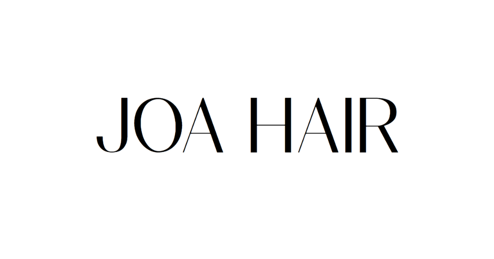

  </img> 

  # JOA HAIR

  ### JOA HAIR 프로젝트는 헤어살롱의 비즈니스 마케팅을 위해 제작된 웹사이트 프로젝트입니다.
  </img>
  </img>
  

 

## 기술스택

### 프론트엔드

</img>

### 백엔드(서버리스)

</img>

### 인프라
</img>

### 기타
</img>

 

## 인프라구조
</img>
